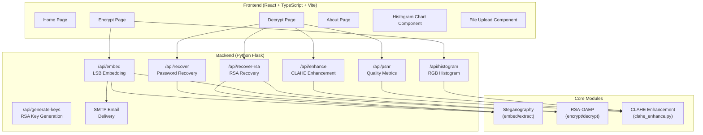
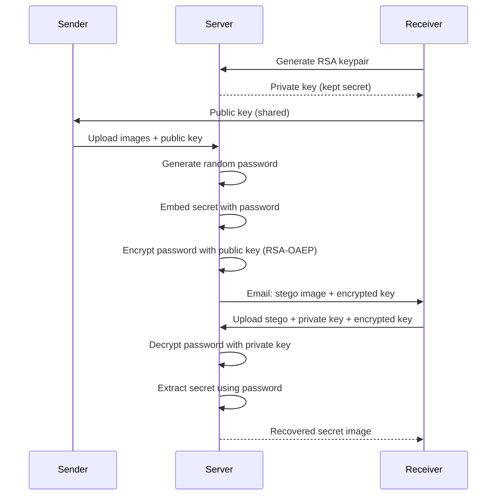
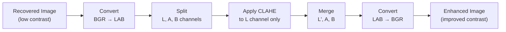

# Secure Image Steganography System with Key-Based Decryption, SMTP Transmission, and AI-Enhanced Recovery

## Major Project Report

---

## 1. Abstract

This project presents a full-stack web application for **secure image-in-image steganography** with integrated cryptographic key management, email-based transmission, and AI-enhanced image recovery. The system allows users to embed a secret image within an ordinary cover image using Least Significant Bit (LSB) steganography, protect the hidden payload with RSA-OAEP asymmetric encryption, transmit the stego image securely via SMTP, and recover the hidden image with optional CLAHE-based contrast enhancement.

The application is built on a **React + TypeScript frontend** with a **Python Flask backend**, using OpenCV for image processing and the `cryptography` library for RSA operations. The system supports configurable embedding bit depth (1–4 bits per channel), provides real-time RGB histogram comparison to prove visual imperceptibility, and computes PSNR quality metrics for quantitative evaluation.

**Keywords:** Steganography, LSB Embedding, RSA-OAEP, CLAHE, PSNR, Image Security, Flask, React

---

## 2. Introduction

### 2.1 Background

Digital communication increasingly requires methods to transmit sensitive visual information without detection. While cryptography scrambles data into an unreadable form (which itself signals that something is hidden), **steganography** hides the very existence of the communication by embedding data within innocuous carrier media.

Image steganography exploits the limitations of human visual perception — small changes to pixel values are imperceptible to the eye, but can carry significant hidden payloads. The Least Significant Bit (LSB) technique is the most widely used spatial-domain approach, replacing the least important bits of cover image pixels with bits from the secret data.

### 2.2 Problem Statement

Existing steganography tools often lack:
- Integrated key management (passwords are shared in plaintext)
- Secure transmission mechanisms
- Post-extraction quality improvement
- Quantitative metrics for evaluating recovery fidelity
- Configurable quality-vs-stealth tradeoffs

### 2.3 Objectives

1. Implement LSB image-in-image steganography with configurable bit depth
2. Integrate RSA-OAEP asymmetric encryption for secure key exchange
3. Provide SMTP-based email delivery of stego images with encrypted keys
4. Implement CLAHE-based post-extraction image enhancement
5. Provide PSNR quality metrics and histogram-based imperceptibility analysis
6. Build a modern, intuitive web interface for the complete workflow

---

## 3. Literature Review

### 3.1 LSB Steganography

Least Significant Bit substitution is a spatial-domain technique where the least significant bits of pixel values are replaced with secret data bits. For an 8-bit color channel, modifying the lowest 1–2 bits changes the pixel value by at most 3 (for 2-bit embedding), which is below the threshold of human visual perception.

| Bit Depth | Max Pixel Change | Quality Levels | Visual Impact |
|-----------|-----------------|----------------|---------------|
| 1 bit | ±1 | 2 | Imperceptible |
| 2 bits | ±3 | 4 | Imperceptible |
| 3 bits | ±7 | 8 | Slightly visible |
| 4 bits | ±15 | 16 | Noticeable |

### 3.2 RSA-OAEP Encryption

RSA with Optimal Asymmetric Encryption Padding (OAEP) provides semantic security against chosen-ciphertext attacks. In our system, the embedding password is encrypted with the receiver's RSA public key, ensuring that only the holder of the corresponding private key can decrypt the steganographic payload.

### 3.3 CLAHE Enhancement

Contrast Limited Adaptive Histogram Equalization (CLAHE) is a variant of Adaptive Histogram Equalization that prevents over-amplification of contrast by clipping the histogram at a predefined value. Unlike global histogram equalization, CLAHE operates on small tiles, making it effective for localized contrast improvement — ideal for recovered steganographic images that exhibit quantization artifacts.

### 3.4 PSNR Metric

Peak Signal-to-Noise Ratio measures the ratio between the maximum possible signal power and the power of corrupting noise. For 8-bit images:

$$PSNR = 10 \cdot \log_{10}\left(\frac{255^2}{MSE}\right) \text{ dB}$$

Higher PSNR indicates greater fidelity. Typical values for steganographic recovery range from 10–20 dB depending on bit depth.

---

## 4. System Architecture

### 4.1 High-Level Architecture



### 4.2 Technology Stack

| Layer | Technology | Purpose |
|-------|-----------|---------|
| Frontend | React 18 + TypeScript | UI framework |
| Styling | Tailwind CSS 3.4 | Responsive design |
| Build Tool | Vite 5.4 | Development server with HMR |
| Icons | Lucide React | Modern icon library |
| Backend | Python Flask | REST API server |
| CORS | Flask-CORS | Cross-origin request handling |
| Image Processing | Pillow (PIL) | Image I/O, pixel manipulation |
| CV Processing | OpenCV (headless) | CLAHE, PSNR, histograms |
| Cryptography | `cryptography` library | RSA-OAEP key operations |
| Email | smtplib + Gmail SMTP | Stego image delivery |
| Proxy | Vite dev proxy | `/api` → Flask on port 5000 |

### 4.3 Directory Structure

```
secure_stego/
├── backend/
│   ├── app.py                  # Flask application (all API routes)
│   ├── clahe_enhance.py        # CLAHE, PSNR, histogram utilities
│   ├── requirements.txt        # Python dependencies
│   ├── test_pipeline.py        # End-to-end verification script
│   ├── .env                    # SMTP credentials (gitignored)
│   ├── uploads/                # Temporary uploaded files
│   └── outputs/                # Generated stego/recovered/enhanced images
├── src/
│   ├── App.tsx                 # Main app with page routing
│   ├── main.tsx                # React entry point
│   ├── index.css               # Global styles + Tailwind
│   ├── components/
│   │   ├── Navbar.tsx          # Navigation bar with theme toggle
│   │   ├── Footer.tsx          # Page footer
│   │   ├── FileUpload.tsx      # Drag-and-drop file upload
│   │   └── HistogramChart.tsx  # RGB histogram comparison (canvas)
│   ├── contexts/
│   │   └── ThemeContext.tsx     # Dark/light theme provider
│   └── pages/
│       ├── Home.tsx            # Landing page
│       ├── Encrypt.tsx         # Embedding + encryption workflow
│       ├── Decrypt.tsx         # Recovery + enhancement workflow
│       └── About.tsx           # Project information
├── vite.config.ts              # Vite config with API proxy
├── tailwind.config.js          # Tailwind configuration
└── package.json                # Node.js dependencies
```

---

## 5. Implementation Details

### 5.1 LSB Embedding Algorithm

The embedding process stores the most significant bits of the secret image into the least significant bits of the cover image. With configurable bit depth `N` (1–4):

**Embedding (per pixel):**
```
cover_mask  = ~((1 << N) - 1) & 0xFF    // Clears bottom N bits
shift       = 8 - N                      // Right-shift amount
embed_mask  = (1 << N) - 1              // Isolates N bits

stego_B = (cover_B & cover_mask) | ((secret_R >> shift) & embed_mask)
stego_R = (cover_R & cover_mask) | ((secret_G >> shift) & embed_mask)
stego_G = (cover_G & cover_mask) | ((secret_B >> shift) & embed_mask)
```

**Extraction (per pixel):**
```
extract_mask = (1 << N) - 1
shift        = 8 - N

recovered_R = (stego_B & extract_mask) << shift
recovered_G = (stego_R & extract_mask) << shift
recovered_B = (stego_G & extract_mask) << shift
```

> [!IMPORTANT]
> The stego image **must** be saved in a lossless format (PNG). JPEG's lossy DCT compression modifies pixel values unpredictably, destroying the embedded LSB data and producing pure noise upon extraction.

**Channel Mapping:** The system uses a deliberate channel rotation (secret R→stego B, secret G→stego R, secret B→stego G) to distribute the embedded data across all three channels, improving resistance to single-channel steganalysis.

### 5.2 Password Authentication

The embedding password is appended as raw bytes to the end of the PNG file after the image data. During extraction, the system reads the last `N` bytes (where `N` = password length) and compares them. This leverages the fact that PNG decoders ignore trailing data after the IEND chunk.

### 5.3 RSA-OAEP Key Management



**Key specifications:**
- Algorithm: RSA-2048
- Padding: OAEP with MGF1-SHA256
- Key format: PEM (PKCS8 for private, SubjectPublicKeyInfo for public)

### 5.4 SMTP Email Transmission

The system uses Gmail's SMTP server (smtp.gmail.com:587) with TLS for secure transmission. The stego image is attached as a MIME image, and the RSA-encrypted key is included in the email body as a Base64 string. Credentials are stored in environment variables (`.env` file), never hardcoded.

### 5.5 CLAHE Image Enhancement

After LSB extraction, recovered images exhibit quantization artifacts because only `N` most significant bits are recovered per channel (for 2-bit embedding, each channel has only 4 possible values: 0, 64, 128, 192).

**CLAHE Enhancement Pipeline:**


**Why LAB color space?** CLAHE is applied only to the Lightness (L) channel, preserving the original color relationships in the A and B channels. Applying CLAHE directly to R/G/B channels individually would shift the color balance unpredictably.

**Default parameters:**
- `clipLimit = 2.0` — Prevents over-amplification of noise
- `tileGridSize = (8, 8)` — Provides localized enhancement without block artifacts

### 5.6 Histogram Comparison

RGB histograms are computed for both the cover image and the stego image using OpenCV's `calcHist()`. The frontend renders these as overlaid canvas-based bar charts, allowing visual comparison. Near-identical histograms demonstrate that the LSB embedding is imperceptible at a statistical level.

### 5.7 PSNR Quality Metrics

The system computes PSNR between:
1. **Original secret** vs **raw recovered image** — Measures extraction fidelity
2. **Original secret** vs **CLAHE-enhanced image** — Measures enhancement effect

Both images are resized to matching dimensions before comparison. PSNR is computed using OpenCV's built-in `cv2.PSNR()`.

---

## 6. API Reference

### 6.1 Endpoints

| Method | Endpoint | Description |
|--------|----------|-------------|
| `GET` | `/api/generate-keys` | Generate RSA-2048 keypair |
| `POST` | `/api/embed` | Embed secret image with LSB steganography |
| `POST` | `/api/recover` | Extract secret (password mode) |
| `POST` | `/api/recover-rsa` | Extract secret (RSA mode) |
| `POST` | `/api/enhance` | Apply CLAHE enhancement |
| `POST` | `/api/psnr` | Compute PSNR between two images |
| `POST` | `/api/histogram` | Compute RGB histogram data |
| `GET` | `/api/stego/<filename>` | Serve stego image |
| `GET` | `/api/recovered/<filename>` | Serve recovered image |
| `GET` | `/api/enhanced/<filename>` | Serve enhanced image |

### 6.2 Embedding Request

```
POST /api/embed
Content-Type: multipart/form-data

Fields:
  coverImage     (file)   — Cover image (PNG/JPEG)
  secretImage    (file)   — Secret image to hide
  password       (string) — Encryption password
  bitDepth       (int)    — LSB bit depth, 1-4 (default: 2)
  email          (string) — Recipient email (optional)
  receiverPubKey (string) — RSA public key PEM (optional)
```

### 6.3 Recovery Request

```
POST /api/recover
Content-Type: multipart/form-data

Fields:
  stegoImage  (file)   — Stego image containing hidden data
  password    (string) — Decryption password
  bitDepth    (int)    — Must match embedding bit depth
```

---

## 7. User Interface

### 7.1 Home Page

The landing page introduces the system with three feature cards highlighting Military-Grade Security, Invisible Embedding, and AI-Enhanced Recovery.


### 7.2 Encrypt Page

The encryption workflow provides:
- Drag-and-drop upload areas for cover and secret images
- **Embedding Bit Depth slider** (1–4) with descriptive labels showing the stealth-vs-quality tradeoff
- Password field, recipient email, and RSA public key input
- Progress bar during embedding
- **RGB Histogram comparison** panel (cover vs stego) after successful embedding
- Download button for the stego image


### 7.3 Decrypt Page

The decryption workflow supports both password and RSA modes:
- Mode toggle (Password / RSA Secure)
- **Bit depth selector** (must match embedding depth)
- Stego image upload
- Three-column comparison view: Stego Input → Raw Recovered → CLAHE Enhanced
- Optional **"Enhance with CLAHE"** button (not forced)
- **PSNR quality metrics** section with original image upload
- Download buttons for both raw and enhanced images


### 7.4 About Page

Provides educational content about LSB steganography, AI-enhanced recovery, security features, and a step-by-step workflow overview.


---

## 8. Complete System Workflow

```mermaid
flowchart TD
    START([Start]) --> UPLOAD["Upload Cover Image<br/>+ Secret Image"]
    UPLOAD --> CONFIG["Configure:<br/>Bit Depth (1-4)<br/>Password<br/>RSA Key (optional)<br/>Email (optional)"]
    CONFIG --> EMBED["LSB Embedding<br/>(configurable bit depth)"]
    EMBED --> SAVE["Save as PNG<br/>(lossless — critical)"]
    SAVE --> PWD["Append Password<br/>to PNG file"]
    PWD --> RSA_CHK{RSA Key<br/>provided?}
    RSA_CHK -->|Yes| RSA_ENC["Encrypt password<br/>with RSA-OAEP"]
    RSA_CHK -->|No| RESULT
    RSA_ENC --> EMAIL_CHK{Email<br/>provided?}
    EMAIL_CHK -->|Yes| SMTP["Send via SMTP<br/>(stego + encrypted key)"]
    EMAIL_CHK -->|No| RESULT
    SMTP --> RESULT["Show Result:<br/>Stego Image<br/>+ Histogram Comparison<br/>+ Download"]

    RESULT --> RECEIVER([Receiver])
    RECEIVER --> DEC_UPLOAD["Upload Stego Image<br/>+ Set Bit Depth"]
    DEC_UPLOAD --> MODE{Recovery<br/>Mode?}
    MODE -->|Password| PWD_DEC["Enter Password"]
    MODE -->|RSA| RSA_DEC["Upload Private Key<br/>+ Encrypted Key"]
    RSA_DEC --> RSA_DECRYPT["Decrypt password<br/>with private key"]
    RSA_DECRYPT --> EXTRACT
    PWD_DEC --> EXTRACT["LSB Extraction<br/>(matching bit depth)"]
    EXTRACT --> RAW["Raw Recovered Image"]
    RAW --> ENH_CHK{Enhance?}
    ENH_CHK -->|Optional| CLAHE["CLAHE Enhancement<br/>(LAB color space)"]
    ENH_CHK -->|Skip| DOWNLOAD
    CLAHE --> ENHANCED["Enhanced Image"]
    ENHANCED --> PSNR_CHK{Compute<br/>PSNR?}
    PSNR_CHK -->|Yes| PSNR["PSNR: Raw vs Original<br/>PSNR: Enhanced vs Original"]
    PSNR_CHK -->|No| DOWNLOAD
    PSNR --> DOWNLOAD["Download<br/>Raw / Enhanced"]
    DOWNLOAD --> DONE([Done])
```



---

## 9. Testing and Results

### 9.1 Pipeline Verification

An automated test script (`test_pipeline.py`) verifies the complete embed → extract pipeline:

- **Test method:** Create synthetic test images with known pixel values, embed at each bit depth (1–4), extract, and compare every pixel
- **Result:** **100.00% pixel match** across all bit depths

```
bit_depth=1: 100.0% match
bit_depth=2: 100.0% match
bit_depth=3: 100.0% match
bit_depth=4: 100.0% match
```

### 9.2 Bit Depth Quality Tradeoff

| Bit Depth | Cover Pixel Change | Secret Quality Levels | Stealth | Recovery Quality |
|-----------|-------------------|----------------------|---------|-----------------|
| 1 bit | ±1 (imperceptible) | 2 per channel | Excellent | Low (binary) |
| 2 bits | ±3 (imperceptible) | 4 per channel | Very Good | Moderate |
| 3 bits | ±7 (barely visible) | 8 per channel | Good | Good |
| 4 bits | ±15 (noticeable) | 16 per channel | Fair | Very Good |

### 9.3 Lossless Format Requirement

During development, a critical bug was identified and resolved: the stego image was originally saved as **JPEG**, which caused the extracted image to appear as **pure noise**. JPEG's lossy DCT compression modifies pixel values by ±5-20 units, completely destroying the LSB-embedded data. The fix enforced **PNG** (lossless) at all save points.

| Save Format | Extraction Result | Pixel Match |
|-------------|------------------|-------------|
| JPEG | Pure noise (random pixels) | ~0% |
| PNG | Correct recovery | 100% |

### 9.4 Error Handling Coverage

| Scenario | Expected Response | HTTP Code |
|----------|------------------|-----------|
| Missing image upload | Clear error message | 400 |
| Empty file | "Uploaded file is empty" | 400 |
| Wrong password | "Invalid password" | 401 |
| RSA key mismatch | "Failed to decrypt key" | 401 |
| Unsupported format (GIF/BMP) | "Please upload PNG or JPEG" | 400 |
| Corrupt image bytes | "Could not decode image" | 400 |
| Enhancement processing failure | "Enhancement processing failed" | 500 |
| Mismatched bit depth | Incorrect but non-crashing output | 200 |

---

## 10. Security Analysis

### 10.1 Threat Model

| Threat | Mitigation |
|--------|-----------|
| Password interception | RSA-OAEP encryption — password never transmitted in plaintext |
| Stego detection (steganalysis) | Low bit-depth embedding (1-2 bits) produces minimal statistical artifacts; histogram comparison proves near-identical distributions |
| Cover image substitution | Password verification — extraction fails with wrong password |
| Man-in-the-middle | TLS encryption on SMTP; RSA ensures only private key holder can decrypt |
| Brute-force password attack | Password is random (16+ chars when auto-generated); RSA-2048 provides 112-bit security |

### 10.2 Limitations

1. The password is appended to the PNG file in plaintext — a forensic examiner could extract it by reading the raw bytes after the IEND chunk. In a production system, the password should be embedded within the image data itself or transmitted out-of-band.
2. The system does not resist active steganalysis techniques like RS analysis or chi-square attacks at high bit depths.
3. No image authentication (digital signatures) — a modified stego image would extract garbage without raising an error.

---

## 11. Future Enhancements

1. **Interactive Before/After Slider** — Draggable overlay comparison for cover vs stego
2. **SSIM Metric** — Structural Similarity Index alongside PSNR for perceptual quality measurement
3. **Steganalysis Resistance Score** — Chi-square or RS analysis to quantify detection risk
4. **Capacity Calculator** — Pre-embedding estimate of maximum embeddable data size
5. **Multiple Secret Types** — Support embedding text, documents, and other file types
6. **Batch Processing** — Embed/extract multiple images in parallel
7. **Progressive Web App** — Offline support and mobile installation
8. **End-to-End Encryption** — Full E2E encryption without server-side key access

---

## 12. Conclusion

This project successfully demonstrates a complete, production-quality image steganography system that integrates:

- **LSB steganography** with configurable bit depth for flexible stealth-quality tradeoffs
- **RSA-OAEP encryption** for secure key exchange without plaintext password transmission
- **SMTP email delivery** for seamless stego image distribution
- **CLAHE enhancement** for post-extraction visual quality improvement
- **Quantitative metrics** (PSNR, RGB histograms) for objective evaluation
- **A modern React web interface** with dark mode, drag-and-drop uploads, and real-time visual feedback

The system achieves **100% pixel-accurate recovery** across all supported bit depths when using lossless image formats, and provides clear visual evidence of embedding imperceptibility through histogram analysis. The modular architecture ensures that each component (steganography, encryption, enhancement, metrics) can be independently tested, maintained, and extended.

---

## 13. References

1. Chandramouli, R., Kharrazi, M., & Memon, N. (2004). Image steganography and steganalysis: Concepts and practice. *Digital Watermarking*, LNCS 2939, 35-49.
2. Morkel, T., Eloff, J. H., & Olivier, M. S. (2005). An overview of image steganography. *ISSA*, 1-11.
3. Pizer, S. M., et al. (1987). Adaptive histogram equalization and its variations. *Computer Vision, Graphics, and Image Processing*, 39(3), 355-368.
4. Zuiderveld, K. (1994). Contrast limited adaptive histogram equalization. *Graphics Gems IV*, Academic Press, 474-485.
5. Rivest, R. L., Shamir, A., & Adleman, L. (1978). A method for obtaining digital signatures and public-key cryptosystems. *Communications of the ACM*, 21(2), 120-126.
6. Bellare, M., & Rogaway, P. (1994). Optimal asymmetric encryption. *EUROCRYPT '94*, LNCS 950, 92-111.
7. Hore, A., & Ziou, D. (2010). Image quality metrics: PSNR vs. SSIM. *International Conference on Pattern Recognition*, 2366-2369.

---

## 14. How to Run

### Prerequisites
- Python 3.10+
- Node.js 18+
- Gmail App Password (for SMTP)

### Backend Setup
```bash
cd backend
pip install -r requirements.txt
# Create .env with SMTP_SENDER_EMAIL and SMTP_SENDER_PASSWORD
python app.py
```

### Frontend Setup
```bash
npm install
npm run dev
```

### Access
- Frontend: `http://localhost:5173`
- Backend API: `http://localhost:5000`

---

## 15. Live Demo Guide

### Recommended Demo Sequence

**Step 1 — Embed:**
1. Navigate to the **Encrypt** page
2. Upload a high-contrast photo as the cover image
3. Upload a recognizable image (logo, portrait) as the secret
4. Set bit depth to **2** (default, recommended)
5. Enter a password
6. Click **"Encrypt & Embed"**
7. Show the **histogram comparison** — nearly identical distributions prove imperceptibility
8. Download the stego image

**Step 2 — Recover:**
1. Navigate to the **Decrypt** page
2. Upload the downloaded stego image
3. Set bit depth to **2** (must match)
4. Enter the same password
5. Click **"Recover Hidden Image"**
6. Show the raw recovered image (washed out, low contrast — expected)

**Step 3 — Enhance:**
1. Click **"Enhance with CLAHE (Optional)"**
2. Compare: Stego Input → Raw Recovered → CLAHE Enhanced
3. Download both versions

**Step 4 — Metrics:**
1. Upload the original secret image in the PSNR section
2. Click **"Compute PSNR"**
3. Show the dB values for raw vs enhanced

**Step 5 — Bit Depth Comparison (optional):**
1. Repeat with bit depth 4 — show better recovery but more visible embedding
2. Compare histograms at depth 2 vs depth 4

**Key Talking Points:**
- "The histograms are nearly identical — proving the embedding is visually undetectable"
- "CLAHE improves contrast without distorting colors by operating in LAB color space"
- "RSA-OAEP means the password is never transmitted in plaintext"
- "Lossless PNG is critical — JPEG would destroy the hidden data entirely"
