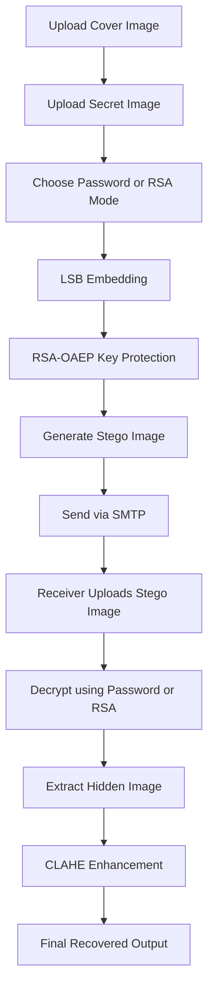

<div align="center">

# 🔐 Secure Image Steganography System
### RSA Secure Key Exchange + SMTP Delivery + CLAHE Enhanced Recovery

<p align="center">
  
  
  
  
  
  
</p>

<p align="center">
  A secure image steganography platform that combines hidden image embedding,
  RSA-based key protection, SMTP delivery, and CLAHE image enhancement
  into one complete workflow.
</p>

</div>

---

# 📌 Overview

This project focuses on secure hidden communication using image steganography.

A secret image is embedded inside a cover image using the LSB (Least Significant Bit) technique while maintaining minimal visible distortion.

To strengthen security, the decryption key can be protected using RSA public-key encryption. The generated stego image can also be transmitted through Gmail SMTP. After extraction, CLAHE-based enhancement is used to improve the visual quality of distorted recovered images.

---

# ✨ Core Features

| Feature | Description |
|---|---|
| 🔒 LSB Steganography | Hides a secret image inside a cover image |
| 🔑 RSA-OAEP Encryption | Secures the decryption key |
| 📧 SMTP Delivery | Sends stego image through email |
| 🖼️ CLAHE Enhancement | Improves extracted image quality |
| 🔄 Dual Recovery Modes | Password mode + RSA secure mode |
| 🌐 Modern Web UI | Responsive React + Tailwind interface |
| 📊 Quality Evaluation | PSNR and visual comparison support |

---

# 🧠 System Workflow



---

# 🏗️ Tech Stack

| Layer | Technology | Purpose |
|---|---|---|
| Frontend | React + TypeScript | User Interface |
| Styling | Tailwind CSS | Responsive Design |
| Backend | Flask | API and Processing |
| Image Processing | Pillow + OpenCV | Embedding and Enhancement |
| Cryptography | RSA-OAEP | Secure Key Exchange |
| Communication | SMTP | Email Transmission |
| Build Tool | Vite | Frontend Development |

---

# 📂 Project Structure

```text
secure_stego/
│
├── backend/
│   ├── app.py
│   ├── routes/
│   ├── encryption/
│   └── enhancement/
│
├── src/
│   ├── pages/
│   ├── components/
│   └── utils/
│
├── research/
├── Secret Images/
├── Cover image folder/
├── Results.ipynb
├── PROJECT_REPORT.md
└── README.md
```

---

# ⚙️ Installation & Setup

## 1️⃣ Clone Repository

```bash
git clone https://github.com/sanidhyathakur/secure_stego.git
cd secure_stego
```

---

## 2️⃣ Backend Setup

```bash
cd backend
pip install -r requirements.txt
python app.py
```

Backend runs at:

```text
http://localhost:5000
```

---

## 3️⃣ Frontend Setup

```bash
npm install
npm run dev
```

Frontend runs at:

```text
http://localhost:5173
```

---

# 🔐 Encryption Modes

## Password Mode

- Simple and fast
- User enters password manually
- Hidden image recovered using same password

---

## RSA Secure Mode

- Receiver shares public key
- Sender encrypts password using RSA-OAEP
- Receiver decrypts using private key
- Prevents key exposure during transmission

---

# 📧 SMTP Delivery

The system supports Gmail SMTP integration using App Password authentication.

The following can be sent securely:

- Stego image
- RSA encrypted key
- Recovery details

---

# 🖼️ CLAHE Enhanced Recovery

After extraction, recovered images may appear distorted due to:

- Compression
- Noise
- Resizing
- Transmission effects

To improve visibility, the project integrates:

### CLAHE (Contrast Limited Adaptive Histogram Equalization)

Benefits:

- Better contrast
- Reduced visual distortion
- Improved readability
- Clearer recovered outputs

---

# 📊 Results & Evaluation

| Metric | Purpose | Observation |
|---|---|---|
| PSNR | Measures image quality | High visual similarity |
| Extraction Accuracy | Checks correct recovery | Successful extraction |
| Visual Comparison | Cover vs Stego difference | Minimal distortion |
| CLAHE Enhancement | Recovery improvement | Clearer extracted image |

---

# 🖼️ Screenshots

## 🔹 Encryption Interface

```text
assets/encryption-page.png
```

## 🔹 RSA Secure Recovery

```text
assets/rsa-recovery.png
```

## 🔹 CLAHE Enhanced Output

```text
assets/clahe-output.png
```

---

# 📈 Suggested README Additions

You can make the repository even stronger by adding:

- Demo GIF
- Before/After enhancement comparison
- PSNR graph
- Histogram comparison
- Architecture diagram
- Flowchart image
- Deployment screenshots

---

# 🚀 Future Improvements

- SSIM-based quality analysis
- Steganalysis resistance scoring
- Batch processing support
- Multiple secret file types
- Progressive Web App support
- End-to-end encryption
- Video steganography

---

# 🎥 Demo

```text
assets/demo.gif
```

---

# 👨‍💻 Contributors

- Arindam
- Vanshaj Sharma
- Ayush Thakur
- Sanidhya Thakur

---

# 📜 License

This project is developed for educational and research purposes.
